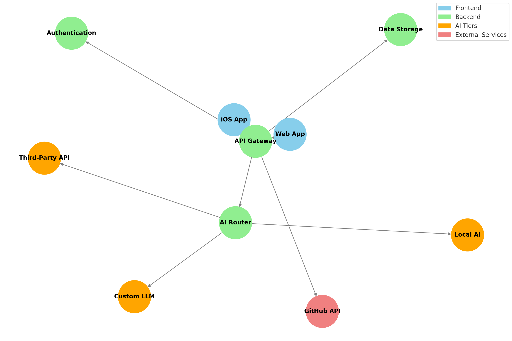
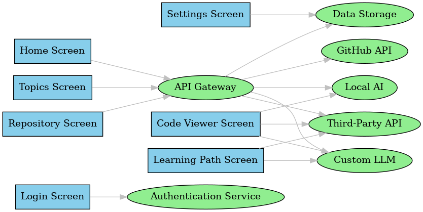

# **CodeNexus.ai**

### **Your Gateway to Mastering Code**

CodeNexus.ai is an AI-driven platform designed to help engineers explore, learn, and master code by creating a nexus of curated repositories and topics. It combines powerful local and cloud-based AI systems with GitHub's vast repository ecosystem to enhance your coding journey.

---

## **Table of Contents**

1. [Overview](#overview)
2. [Features](#features)
3. [System Architecture](#system-architecture)
   - [System Component Diagram](#system-component-diagram)
   - [AI Tier Integration](#ai-tier-integration)
4. [User Flow](#user-flow)
   - [Screens](#screens)
   - [User Flow Diagram](#user-flow-diagram)
5. [Future Enhancements](#future-enhancements)
6. [Development Plan](#development-plan)
7. [Diagrams](#diagrams)

---

## **Overview**

CodeNexus.ai is built to empower developers to:
- **Explore** topics and repositories of interest.
- **Learn** from AI-curated repository insights.
- **Create** a personalized nexus of repositories for long-term mastery.

The app offers three tiers of AI integration:
1. **Local AI**: On-device processing for quick and offline tasks.
2. **Custom LLM**: Your custom-trained open-source LLM for intermediate analysis.
3. **Third-Party AI**: Advanced, resource-intensive tasks handled by APIs like OpenAI.

---

## **Features**

- **Topic Exploration**: Browse GitHub topics and discover repositories based on your interests.
- **Repository Insights**: Gain AI-driven insights, including summaries, tutorials, and suggested learning paths.
- **Code Viewing**: Read and analyze code directly in the app with syntax highlighting and inline AI assistance.
- **Nexus Creation**: Curate your personalized collection of repositories for further study.
- **Settings and Customization**: Adjust preferences, including themes, AI usage, and account settings.

---

## **System Architecture**

CodeNexus.ai is built around a modular architecture for scalability and performance.

### **System Component Diagram**

Below is the system component diagram showing the key components and their interactions.

- **Frontend**: The iOS and Web applications provide the user interface and interact with the backend.
- **Backend**: Manages API calls, authentication, and routing requests to AI services.
- **AI Tiers**: 
  - Local AI for lightweight tasks.
  - Custom LLM for mid-tier processing.
  - Third-Party AI for heavy computational tasks.
- **External Services**: GitHub API for accessing repositories and topics.

### **AI Tier Integration**

- **Local AI**: Processes syntax highlighting and small-scale analyses offline.
- **Custom LLM**: Trained on open-source data for contextual repository insights.
- **Third-Party AI**: Executes complex tasks like generating tutorials or learning paths.

---

## **User Flow**

### **Screens**

1. **Login Screen**:
   - GitHub OAuth login.
   - Option to skip login for limited access.
2. **Home Screen**:
   - Displays trending topics and repositories.
   - Search bar for exploring content.
3. **Topics Screen**:
   - Browse and search topics of interest.
   - View repositories associated with a selected topic.
4. **Repository Screen**:
   - Detailed repository view, including metadata and stars.
   - Option to add to a Nexus or open in the Code Viewer.
5. **Code Viewer Screen**:
   - Inline syntax highlighting.
   - AI-driven code insights and suggestions.
6. **Settings Screen**:
   - Manage preferences, logout, and theme settings.
7. **Learning Path Screen**:
   - AI-curated study plan based on selected repositories.

### **User Flow Diagram**

The following diagram outlines the flow between screens and system components.

- **Login Flow**: Authenticates the user and sets up access tokens.
- **Data Flow**: Screens communicate with the API Gateway to retrieve data from GitHub or AI services.
- **AI Flow**: Determines whether to use Local AI, Custom LLM, or Third-Party APIs based on task complexity.

---

## **Future Enhancements**

1. **Collaborative Nexuses**: Share curated repository collections with peers.
2. **Gamification**: Track learning progress and unlock achievements.
3. **Offline Mode Expansion**: Extend Local AI capabilities for fully offline usage.
4. **Community Contributions**: Create public nexuses for shared learning paths.

---

## **Development Plan**

1. **Frontend**:
   - Build with SwiftUI for iOS.
   - React.js for the web application.
2. **Backend**:
   - Node.js or Python-based backend for API routing.
   - PostgreSQL for data storage and Redis for caching.
3. **AI Integration**:
   - Implement Local AI using CoreML or TensorFlow Lite.
   - Deploy a fine-tuned LLaMA model on self-hosted servers.
   - Integrate third-party APIs like OpenAI for advanced features.
4. **Testing**:
   - Unit tests for backend services and AI tiers.
   - UI testing for frontend applications.

---

## **Diagrams**

### **System Component Diagram**

### **User Flow Diagram**

---

This README provides a comprehensive overview of the **CodeNexus.ai** application, its system design, and user flow. Let me know if you need assistance with additional sections or implementation details.
